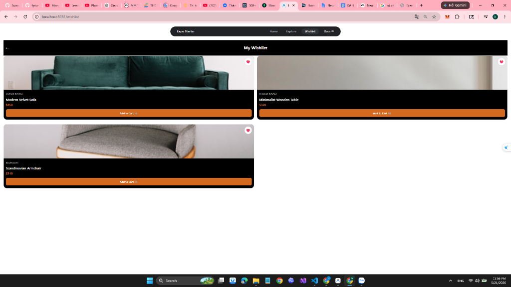

# Changelog

## 1. Quy định ghi Changelog

File này dùng để ghi lại các thay đổi quan trọng trong quá trình thực hiện bài tập, lab, assignment hoặc project.

Nguyên tắc ghi changelog:

- Chỉ ghi những gì đã hoàn thành thật sự.
- Không ghi kế hoạch nếu chưa thực hiện.
- Mỗi thay đổi nên có ngày, nội dung, người thực hiện và minh chứng.
- Nếu có AI hỗ trợ, cần ghi rõ AI đã hỗ trợ phần nào.
- Nếu có commit GitHub, cần ghi link commit.
- Nếu có lỗi đã sửa, cần ghi rõ lỗi, nguyên nhân và cách xử lý.

---

## 2. Thông tin project

| Thông tin | Nội dung |
|---|---|
| Môn học | Multiplatform Mobile App Development_Phát triển ứng dụng di động đa nền tảng |
| Mã môn học | MMA301 |
| Lớp | SE19B05 |
| Học kỳ | 7 |
| Tên bài tập / Project | Làm giao diện trang của từng cá nhân |
| Tên sinh viên / Nhóm | Đinh Huy Hoàng / Nhóm 5 |
| MSSV / Danh sách MSSV | DE180623 |
| Giảng viên hướng dẫn | QuangLTN3 |
| Repository URL | https://github.com/fptu-se-su26/mma301-su26-mma301_se19b05_group-05 |
| Ngày bắt đầu | 21/5/2026 |
| Ngày hoàn thành | 21/5/2026 |

---

## 3. Tổng quan các phiên bản/giai đoạn

| Phiên bản/Giai đoạn | Thời gian | Nội dung chính | Trạng thái |
|---|---|---|---|
| Phase 01 | 2026-05-12 | Khởi tạo project | Completed |
| Phase 02 | 2026-05-14 | Phân tích yêu cầu | Completed |
| Phase 03 | 2026-05-16 | Thiết kế hệ thống | Completed |
| Phase 04 | 2026-05-21 | Implementation | Completed |
| Phase 05 | 2026-05-21 | Testing & Debug | Completed |
| Phase 06 | 2026-05-22 | Hoàn thiện báo cáo và demo | In Progress |

---

# [Phase 01] Khởi tạo project

## Ngày thực hiện

```text
DD/MM/YYYY
```

## Đã hoàn thành

- [ ] Tạo repository
- [ ] Tạo cấu trúc thư mục project
- [ ] Tạo file README.md
- [ ] Tạo thư mục `docs/`
- [ ] Tạo file `AI_AUDIT_LOG.md`
- [ ] Tạo file `PROMPTS.md`
- [ ] Tạo file `REFLECTION.md`
- [ ] Tạo file `CHANGELOG.md`
- [ ] Khởi tạo source code ban đầu
- [ ] Cài đặt thư viện/công cụ cần thiết
- [ ] Cấu hình môi trường chạy project

## Thay đổi chi tiết

| STT | Nội dung thay đổi | Người thực hiện | File/Module liên quan | Minh chứng |
|---:|---|---|---|---|
| 1 |  |  |  |  |
| 2 |  |  |  |  |
| 3 |  |  |  |  |

## AI có hỗ trợ không?

- [ ] Có
- [ ] Không

Nếu có, mô tả AI đã hỗ trợ phần nào:

```text
Viết tại đây...
```

## Commit/Screenshot minh chứng

```text
Dán link commit, screenshot hoặc mô tả minh chứng tại đây...
```

## Ghi chú

```text
Viết tại đây...
```

---

# [Phase 02] Phân tích yêu cầu

## Ngày thực hiện

```text
DD/MM/YYYY
```

## Đã hoàn thành

- [ ] Xác định problem statement
- [ ] Xác định user roles
- [ ] Viết user stories
- [ ] Viết use cases
- [ ] Xác định functional requirements
- [ ] Xác định non-functional requirements
- [ ] Xác định business rules
- [ ] Xác định acceptance criteria
- [ ] Review yêu cầu với giảng viên/nhóm
- [ ] Chỉnh sửa yêu cầu sau feedback

## Thay đổi chi tiết

| STT | Nội dung thay đổi | Người thực hiện | File/Module liên quan | Minh chứng |
|---:|---|---|---|---|
| 1 |  |  |  |  |
| 2 |  |  |  |  |
| 3 |  |  |  |  |

## AI có hỗ trợ không?

- [ ] Có
- [ ] Không

Nếu có, mô tả AI đã hỗ trợ phần nào:

```text
Viết tại đây...
```

## Commit/Screenshot minh chứng

```text
Dán link commit, screenshot hoặc mô tả minh chứng tại đây...
```

## Ghi chú

```text
Viết tại đây...
```

---

# [Phase 03] Thiết kế hệ thống

## Ngày thực hiện

```text
DD/MM/YYYY
```

## Đã hoàn thành

- [ ] Thiết kế kiến trúc tổng quan
- [ ] Thiết kế database/ERD
- [ ] Thiết kế API
- [ ] Thiết kế giao diện/wireframe
- [ ] Thiết kế flow xử lý
- [ ] Thiết kế class diagram
- [ ] Thiết kế sequence diagram
- [ ] Thiết kế security/authorization flow
- [ ] Review thiết kế
- [ ] Chỉnh sửa thiết kế sau feedback

## Thay đổi chi tiết

| STT | Nội dung thay đổi | Người thực hiện | File/Module liên quan | Minh chứng |
|---:|---|---|---|---|
| 1 |  |  |  |  |
| 2 |  |  |  |  |
| 3 |  |  |  |  |

## AI có hỗ trợ không?

- [ ] Có
- [ ] Không

Nếu có, mô tả AI đã hỗ trợ phần nào:

```text
Viết tại đây...
```

## Commit/Screenshot minh chứng

```text
Dán link commit, screenshot hoặc mô tả minh chứng tại đây...
```

## Ghi chú

```text
Viết tại đây...
```

---

# [Phase 04] Implementation

## Ngày thực hiện

```text
2026-05-21
```

## Đã hoàn thành

- [x] Tạo project structure
- [ ] Cài đặt database connection
- [ ] Xây dựng backend
- [x] Xây dựng frontend
- [ ] Xây dựng authentication/authorization
- [ ] Xử lý CRUD
- [ ] Xử lý validation
- [ ] Tích hợp API
- [ ] Xử lý upload/download file
- [ ] Xử lý lỗi
- [x] Tối ưu giao diện
- [ ] Cập nhật README hướng dẫn chạy

## Thay đổi chi tiết

| STT | Nội dung thay đổi | Người thực hiện | File/Module liên quan | Minh chứng |
|---:|---|---|---|---|
| 1 | Tạo mới giao diện màn hình Wishlist sáng sủa, sạch đẹp | Sinh viên | `src/app/wishlist.tsx` | Commit [Thêm Wishlist Screen] |
| 2 | Đăng ký và hiển thị tab Wishlist trên thanh Tab Bar giao diện Web | Sinh viên | `src/components/app-tabs.web.tsx` | Commit [Cập nhật Tab Bar Web] |
| 3 | Đăng ký tab Wishlist trên thanh điều hướng giao diện Mobile | Sinh viên | `src/components/app-tabs.tsx` | Commit [Cập nhật Tab Bar Mobile] |

## AI có hỗ trợ không?

- [x] Có
- [ ] Không

Nếu có, mô tả AI đã hỗ trợ phần nào:

```text
AI hỗ trợ viết cấu trúc mã nguồn ban đầu cho giao diện `wishlist.tsx`, và chỉ ra vị trí cần thêm trigger đăng ký tab trong cấu hình Expo Router Tab Bar.
```

## Commit/Screenshot minh chứng

```text
- Link Commit: [Commit Hash / URL trên GitHub]
- File liên quan: src/app/wishlist.tsx, src/components/app-tabs.tsx, src/components/app-tabs.web.tsx
```

## Ghi chú

```text
Giao diện đã hiển thị đầy đủ trên cả hai phiên bản Web và Mobile nhưng cần qua giai đoạn kiểm thử để căn chỉnh layout và fix lỗi.
```

---

# [Phase 05] Testing & Debug

## Ngày thực hiện

```text
2026-05-21
```

## Đã hoàn thành

- [ ] Viết test case
- [x] Chạy test chức năng chính
- [x] Kiểm tra output
- [ ] Kiểm tra validation
- [x] Kiểm tra lỗi giao diện
- [ ] Kiểm tra lỗi database
- [ ] Kiểm tra phân quyền
- [ ] Kiểm tra bảo mật cơ bản
- [x] Fix bug
- [x] Chạy lại sau khi fix bug
- [ ] Ghi nhận kết quả test

## Danh sách lỗi đã xử lý

| STT | Lỗi phát hiện | Nguyên nhân | Cách xử lý | Trạng thái |
|---:|---|---|---|---|
| 1 | Click tab Wishlist không thể điều hướng sang trang | Cấu hình tab bar bị ẩn (`href={null}` hoặc thiếu `<TabTrigger>`) | Bổ sung đầy đủ trigger định tuyến đến `/wishlist` | Fixed |
| 2 | Crash ứng dụng Mobile với lỗi "Unexpected text node" | Có ký tự khoảng trắng dư thừa nằm ngoài các thẻ chữ trong JSX | Xóa ký tự trắng thừa và chuẩn hóa cú pháp chú thích JSX | Fixed |
| 3 | Header Expo Starter đè mất tiêu đề trang Wishlist trên Web | Header sử dụng absolute layout đè lên vùng hiển thị thông thường trên trình duyệt | Bổ sung padding-top 80px thích ứng khi chạy trên Web | Fixed |
| 4 | Nút quay lại (Back) không phản hồi | Sử dụng `router.back()` trong khi stack lịch sử trang bị trống | Thay thế bằng `router.push("/")` để luôn điều hướng về trang chủ an toàn | Fixed |
| 5 | Trang Wishlist hiển thị màu nền không nhất quán | Chưa set cứng background color cho safe area và container | Định dạng thuộc tính background màu trắng tinh tế `#fff` | Fixed |

## Thay đổi chi tiết

| STT | Nội dung thay đổi | Người thực hiện | File/Module liên quan | Minh chứng |
|---:|---|---|---|---|
| 1 | Tối ưu nút Back, cấu trúc import tuyệt đối, padding Web và đổi màu nền | Sinh viên | `src/app/wishlist.tsx` | Commit [Tối ưu giao diện và điều hướng Wishlist] |
| 2 | Sửa đổi trigger điều hướng Web | Sinh viên | `src/components/app-tabs.web.tsx` | Commit [Sửa điều hướng Web] |
| 3 | Sửa đổi trigger điều hướng Mobile | Sinh viên | `src/components/app-tabs.tsx` | Commit [Sửa điều hướng Mobile] |

## AI có hỗ trợ không?

- [x] Có
- [ ] Không

Nếu có, mô tả AI đã hỗ trợ phần nào:

```text
AI hỗ trợ phân tích nguyên nhân gây lỗi nghiêm ngặt của React Native đối với các khoảng trắng ngoài thẻ text, và gợi ý giải pháp padding động thông qua thư viện Platform.
```

## Commit/Screenshot minh chứng

```text
- Link Commit: [Commit Hash / URL trên GitHub]
- Screenshot: 
```

## Ghi chú

```text
Toàn bộ các lỗi nghiêm trọng đã được fix triệt để. Giao diện chạy mượt mà, phản hồi nhạy bén và đồng bộ trên cả Web và Mobile.
```

---

# [Phase 06] Hoàn thiện báo cáo và demo

## Ngày thực hiện

```text
DD/MM/YYYY
```

## Đã hoàn thành

- [ ] Hoàn thiện source code
- [ ] Hoàn thiện README.md
- [ ] Hoàn thiện report
- [ ] Hoàn thiện slide
- [ ] Hoàn thiện video demo
- [ ] Kiểm tra lại `AI_AUDIT_LOG.md`
- [ ] Kiểm tra lại `PROMPTS.md`
- [ ] Hoàn thiện `REFLECTION.md`
- [ ] Kiểm tra lại `CHANGELOG.md`
- [ ] Đóng gói bài nộp

## Thay đổi chi tiết

| STT | Nội dung thay đổi | Người thực hiện | File/Module liên quan | Minh chứng |
|---:|---|---|---|---|
| 1 |  |  |  |  |
| 2 |  |  |  |  |
| 3 |  |  |  |  |

## AI có hỗ trợ không?

- [ ] Có
- [ ] Không

Nếu có, mô tả AI đã hỗ trợ phần nào:

```text
Viết tại đây...
```

## Commit/Screenshot minh chứng

```text
Dán link commit, screenshot hoặc mô tả minh chứng tại đây...
```

## Ghi chú

```text
Viết tại đây...
```

---

# 4. Tổng kết thay đổi cuối project

## 4.1. Các chức năng đã hoàn thành

| STT | Chức năng | Trạng thái | Minh chứng | Ghi chú |
|---:|---|---|---|---|
| 1 |  | Completed / Partial / Not Completed |  |  |
| 2 |  | Completed / Partial / Not Completed |  |  |
| 3 |  | Completed / Partial / Not Completed |  |  |
| 4 |  | Completed / Partial / Not Completed |  |  |
| 5 |  | Completed / Partial / Not Completed |  |  |

---

## 4.2. Các chức năng chưa hoàn thành

| STT | Chức năng | Lý do chưa hoàn thành | Hướng cải thiện |
|---:|---|---|---|
| 1 |  |  |  |
| 2 |  |  |  |
| 3 |  |  |  |

---

## 4.3. Tổng hợp AI hỗ trợ trong project

| Hạng mục | AI có hỗ trợ không? | Mức độ hỗ trợ | Ghi chú |
|---|---|---|---|
| Requirement | Có / Không | Ít / Trung bình / Nhiều |  |
| Design | Có / Không | Ít / Trung bình / Nhiều |  |
| Database | Có / Không | Ít / Trung bình / Nhiều |  |
| Coding | Có / Không | Ít / Trung bình / Nhiều |  |
| Debug | Có / Không | Ít / Trung bình / Nhiều |  |
| Testing | Có / Không | Ít / Trung bình / Nhiều |  |
| Report | Có / Không | Ít / Trung bình / Nhiều |  |
| Presentation | Có / Không | Ít / Trung bình / Nhiều |  |

---

## 4.4. Bài học rút ra

```text
Viết tại đây...
```

---

## 4.5. Hướng cải thiện tiếp theo

```text
Viết tại đây...
```

---

# 5. Cam kết cập nhật Changelog

Sinh viên/nhóm cam kết rằng nội dung changelog phản ánh đúng các thay đổi đã thực hiện trong quá trình làm bài tập/project.

| Đại diện sinh viên/nhóm | Ngày xác nhận |
|---|---|
|  |  |
